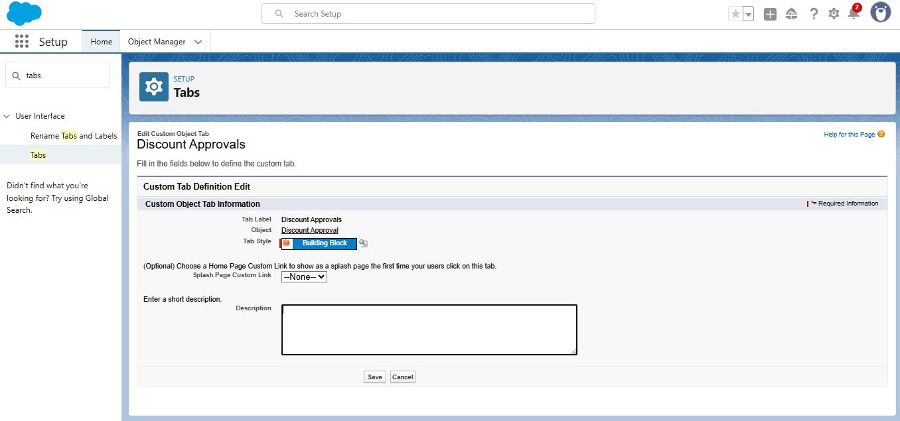

# RevenueOpsApp – Salesforce Setup Documentation  

This document contains step-by-step setup proof for the RevenueOpsApp project with screenshots.  

---

### 1. Signup Confirmation  
- Successfully signed up and logged into Salesforce.  
- **Screenshot:**  
  

---

### 2. Lightning Dashboard  
- Verified Lightning Experience UI.  
- **Screenshot:**  
  

---

### 3. App Branding  
- Customized branding for the app.  
- **Screenshot:**  
  

---

### 4. Navigation Items  
- Added required navigation items for the app.  
- **Screenshot:**  
  

---

### 5. Discount Object  
- Created custom object **Discount Approval**.  
- **Screenshot:**  
  

---

### 6. Fields List  
- Added necessary fields in Discount Approval object.  
- **Screenshot:**  
  

---

### 7. Page Layout  
- Configured page layout for Discount Approval.  
- **Screenshot:**  
  

---

### 8. Tab Navigation  
- Added Discount Approval tab to app navigation.  
- **Screenshot:**  
  

---

### 9. OWD Before  
- Checked Organization-Wide Defaults before changes.  
- **Screenshot:**  
  

---

### 10. OWD After (1)  
- Updated sharing settings (part 1).  
- **Screenshot:**  
  

---

### 11. OWD After (2)  
- Updated sharing settings (part 2).  
- **Screenshot:**  
  

---

### 12. Sharing Rule – 20%  
- Configured sharing rule for discount <= 20%.  
- **Screenshot:**  
  

---

### 13. Sharing Rule – Finance Team  
- Configured sharing rule for Finance team.  
- **Screenshot:**  
  

---

### 14. Business Hours  
- Verified Business Hours settings.  
- **Screenshot:**  
  

---

### 15. Quick Test  
- Created new Discount Approval record in RevenueOpsApp.  
- Verified navigation items and fields display correctly.  
- **Screenshots:**  
    
  

---

✅ **End of Documentation**
