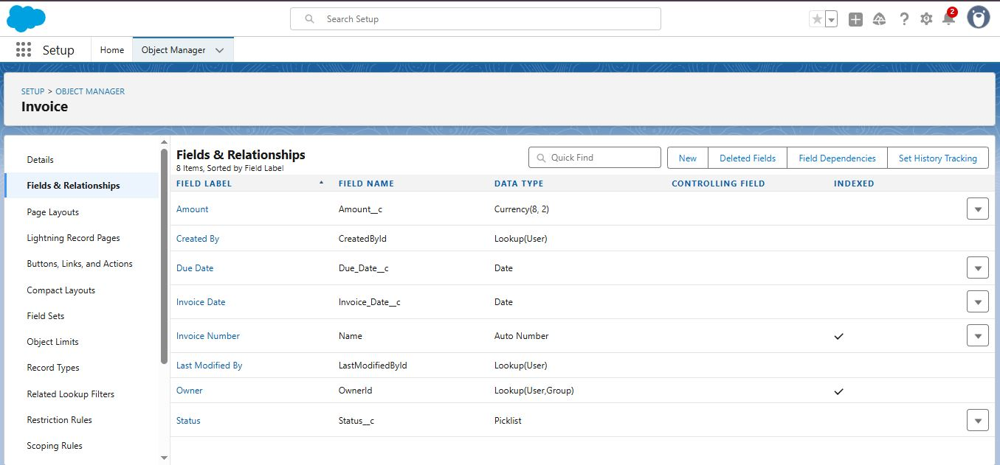
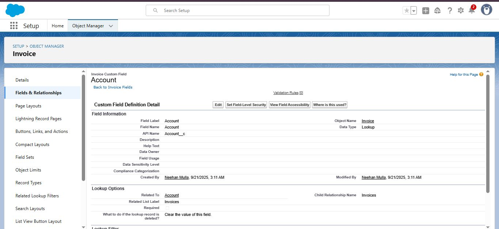
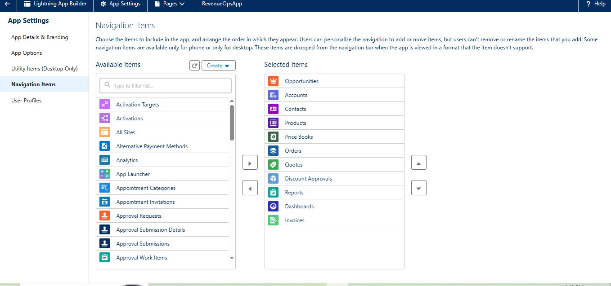
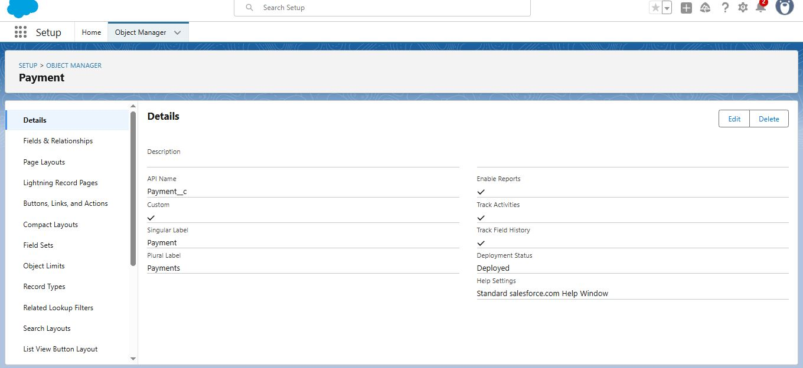
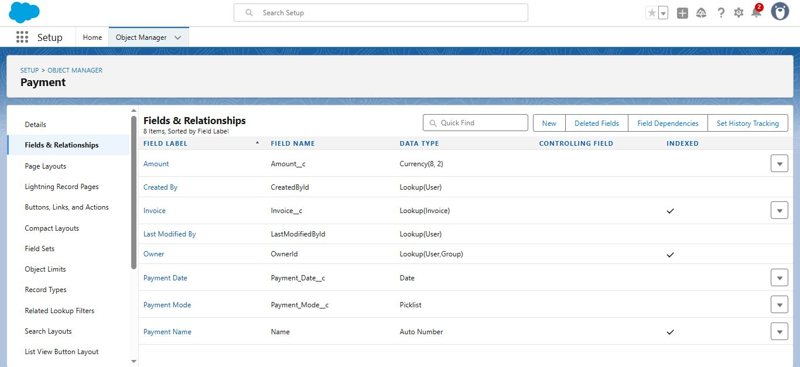
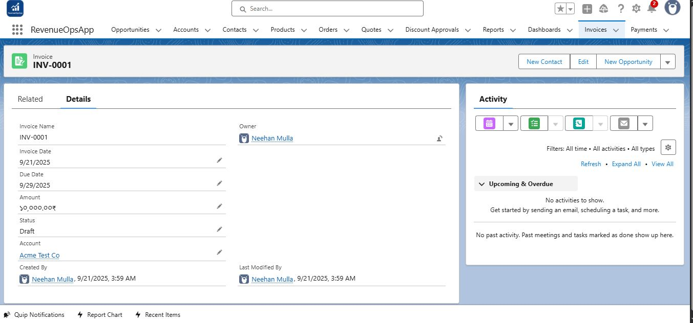

# Phase 3 — Data Modeling & Relationships (RevenueOpsApp)

## Overview  
In Phase 3 we built two custom objects (`Invoice__c` and `Payment__c`), added fields, created relationships, added tabs, and tested object links with sample data. This ensures RevenueOps can track invoices and payments properly.

---

## 1 — Create Invoice (Custom Object: `Invoice__c`)  
**Why:** Developer org standard Invoice object was not available, so we created a custom one.  

**Steps:**  
- Go to **Setup → Object Manager → New Custom Object**  
- Label: `Invoice`  
- Plural: `Invoices`  
- API Name: `Invoice__c`  
- Record Name: Auto Number (`INV-{0000}`)  
- Enable: Reports, Activities, Field History Tracking  
- Save.  

**Screenshot:**  

---

## 2 — Add Fields for Invoice  
**Why:** To capture invoice data like date, amount, and status.  

**Fields Added:**  
- Invoice Date → Date  
- Due Date → Date  
- Amount → Currency  
- Status → Picklist (`Draft`, `Sent`, `Paid`, `Overdue`)  

**Screenshot:**  

---

## 3 — Define Relationships for Invoice  
**Why:** To connect invoices with accounts and orders.  

**Relationships:**  
- Lookup → Invoice to Account  
- Master-Detail → Invoice to Order  

**Screenshot:**  

---

## 4 — Create Invoice Tab & Add to App  
**Why:** To make Invoice visible in RevenueOpsApp navigation.  

**Steps:**  
- Setup → Tabs → New → Custom Object Tab → Select Invoice  
- Choose tab style → Save  
- App Manager → Edit **RevenueOpsApp** → Add Invoice tab to navigation → Save  

**Screenshot:**  

---

## 5 — Create Payment (Custom Object: `Payment__c`)  
**Why:** To track payments received against invoices.  

**Steps:**  
- Setup → Object Manager → New Custom Object  
- Label: `Payment`  
- API Name: `Payment__c`  
- Record Name: Auto Number (`PAY-{0000}`)  
- Enable Reports and Activities  

**Screenshot:**  

---

## 6 — Add Fields & Relationships for Payment  
**Fields:**  
- Payment Date → Date  
- Payment Mode → Picklist (`Cash`, `Card`, `UPI`, `Bank Transfer`)  
- Amount → Currency  
- Related Invoice → Lookup (`Invoice__c`)  

**Screenshot:**  

---

## 7 — Test with Sample Records  
**Steps:**  
- Create a test `Invoice` record linked to an `Account` and `Order`.  
- Create a `Payment` record linked to that `Invoice`.  
- Verify that Invoice shows related Payments under its related list.  

**Screenshot:**  

---

✅ **Phase 3 Completed:** Now invoices and payments are modeled, related, and tested successfully.
