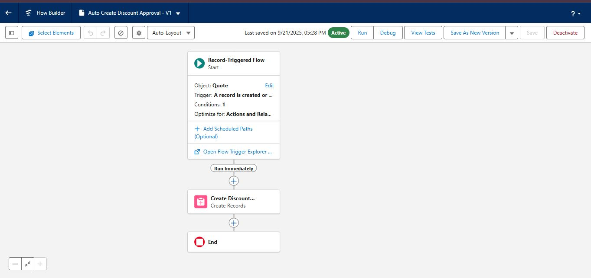
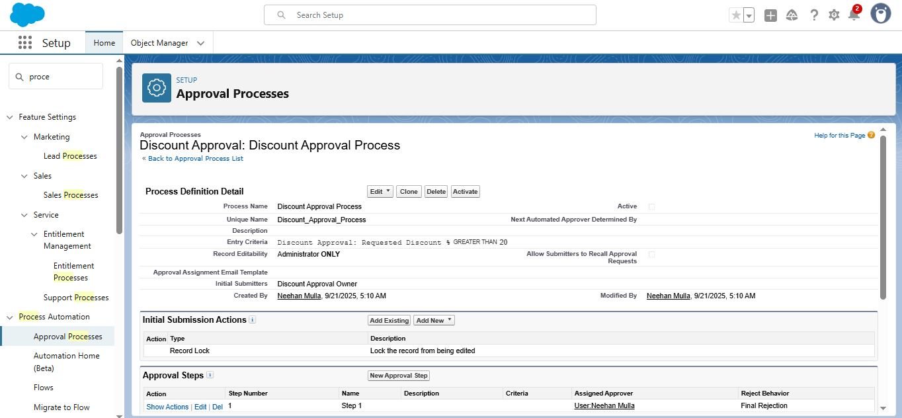
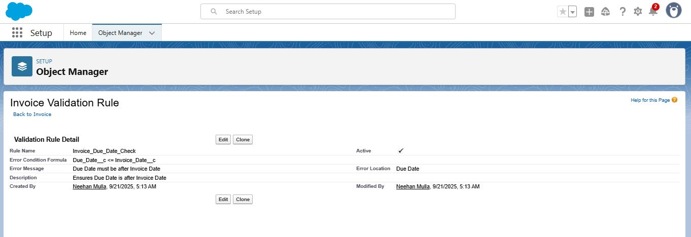
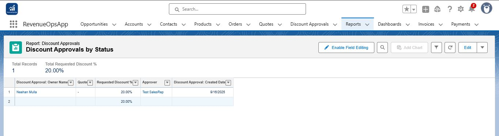
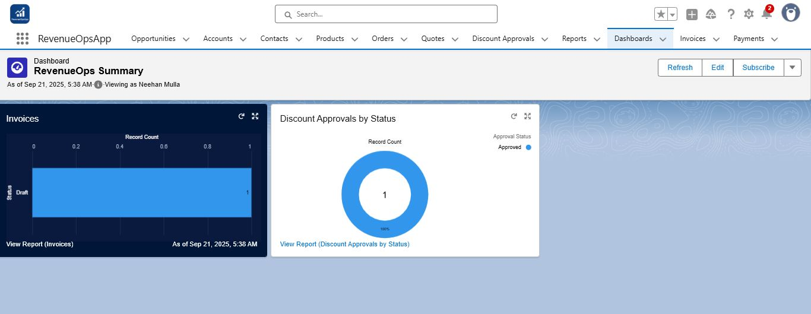

# RevenueOpsApp – Phase 4: Automation & Reporting  

In this phase, automation was implemented using approval processes and flows, and custom reports/dashboards were created to analyze Discount Approvals.  

---

### 1. Flow – Auto Create Discount Approval  
Flow: Record-Triggered Flow on Quote → Trigger: Created or Updated → Condition: Discount > 20%  
Create record → Discount Approval → Fields:  
- Quote → Triggering Quote ID  
- Requested Discount % → Triggering Quote Discount  
- Approval Status → Pending  
**Screenshot:**  

---

### 2. Approval Process – Discount Approval  
Approval Process: Jump Start Wizard  
- Entry Criteria: Requested Discount % > 20  
- Approver: Finance Manager (or your user if manager not available)  
- Submitter → Discount Approval Owner  
**Screenshot:**  

---

### 3. Validation Rule – Invoice Due Date  
Rule: Due Date must be after Invoice Date  
**Screenshot:**  

---

### 4. Report – Discount Approvals by Status  
Report to track Pending / Approved / Rejected discounts  
**Screenshot:**  

---

### 5. Dashboard – RevenueOps Summary  
Dashboard showing total Invoices, Pending Approvals, Paid Invoices  
Charts grouped by Approval Status  
**Screenshot:**  

---

✅ **End of Phase 4 Documentation**
