# Phase 5: Security & Access Control  

This phase ensures that the right people in the RevenueOpsApp have the right level of access using **Profiles, Permission Sets, OWDs, Roles, and Sharing Rules**.  

---

## Step 1 — Profiles & Permission Sets  

### 1A. Finance User Profile  
- Cloned the Standard User profile and created a new **Finance User** profile.  
- Assigned **Salesforce License**.  
- Custom Profile is checked.  
- **Screenshot:**  
  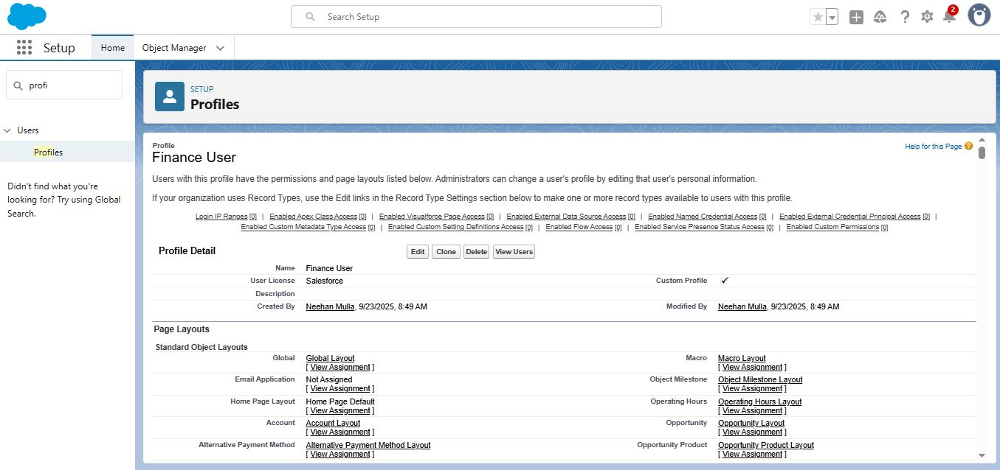  

---

### 1B. Quote Permissions  
- In Finance User Profile → Object Settings → Quote.  
- Granted **Read, Create, Edit, Delete** access.  
- This ensures Finance users can fully manage Quotes.  
- **Screenshot:**  
  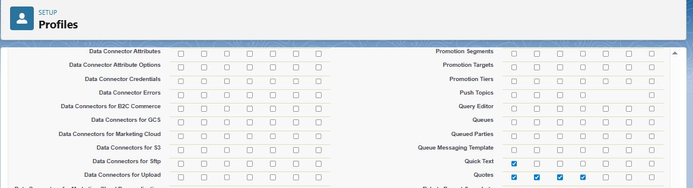  

---

### 1C. Other Object Permissions  
- Verified that **DiscountApproval__c, Payments, and Invoices** have no access at the profile level.  
- This ensures sensitive objects remain restricted.  
- **Screenshot:**  
  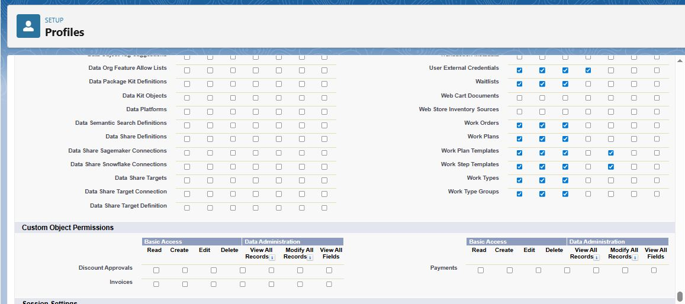  

---

### 1D. Permission Set for Discount Approvals  
- Created a Permission Set: **Discount Approval Access**.  
- License: None.  
- **Screenshot:**  
  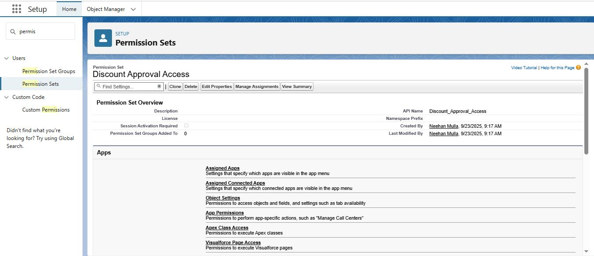  

---

### 1E. Configure DiscountApproval__c in Permission Set  
- In the Permission Set → Object Settings → DiscountApproval__c.  
- Granted:  
  - **Read ✅**  
  - **Create ✅**  
  - **Edit ✅**  
- Left Delete, View All, Modify All unchecked.  
- **Screenshot:**  
  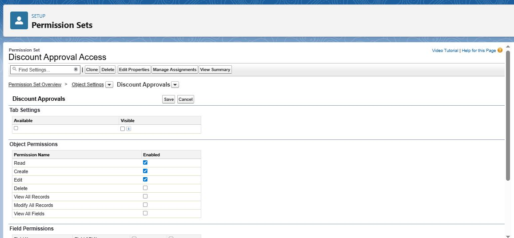  

---

### 1F. Assign Permission Set  
- Assigned **Discount Approval Access** permission set to Finance Manager.  
- This gives Finance Manager control over Discount Approvals.  
- **Screenshot:**  
  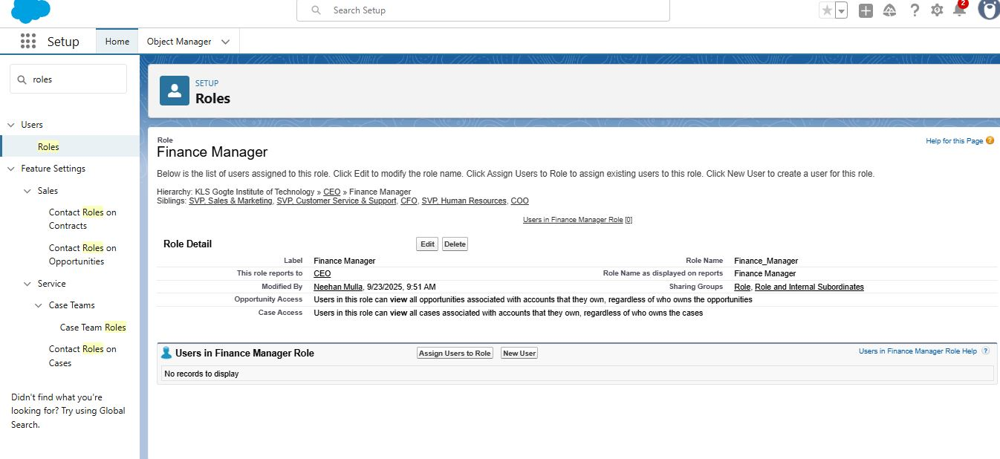  

---

### 1G. Assign Profile & Role to Users  
- Assigned **Finance User Profile** to Finance team members.  
- Assigned **Role = Finance Manager**.  
- This ensures role hierarchy works properly.  
- **Screenshot:**  
  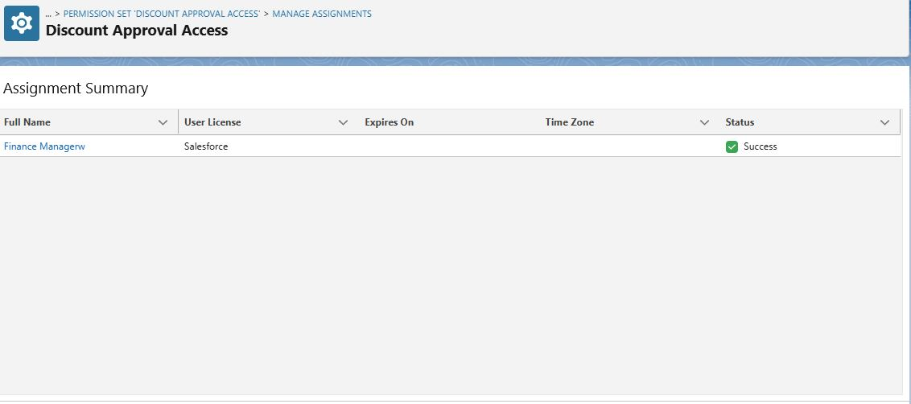  

---

## Step 2 — Organization-Wide Defaults (OWD)  

- Updated OWD settings:  
  - **Invoices = Private**  
  - **Payments = Private**  
  - **Discount Approvals = Private**  
  - **Accounts = Public Read/Write**  
  - **Opportunities = Public Read/Write**  
- This ensures stricter control over finance data while keeping Accounts/Opportunities collaborative.  
- **Screenshot:**  
  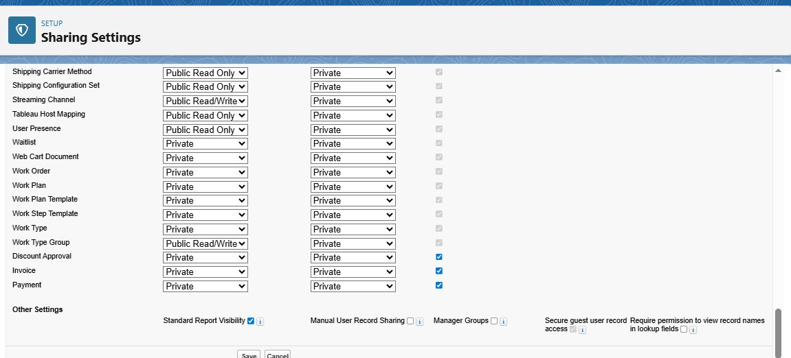  

---

## Step 3 — Role Hierarchy  

- Configured the following role hierarchy:  
  - **CEO**  
    - **Finance Manager**  
      - **Finance Analyst** (optional)  
- Ensures record visibility flows upward.  
- **Screenshots:**  
  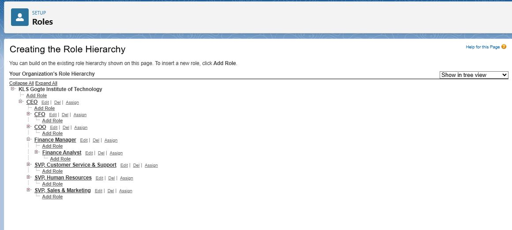  
    
  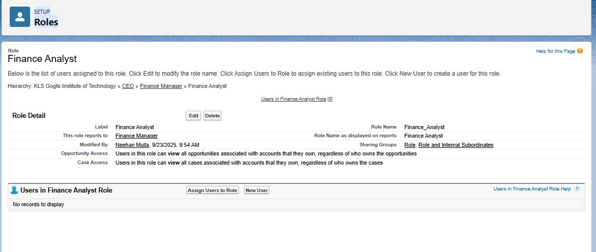  

---

## Step 4 — Sharing Rules  

- Created sharing rule for **Invoices**:  
  - Finance Manager granted **Read/Write** access to Invoices.  
- This ensures Finance Manager has visibility and control over invoice records.  
- **Screenshot:**  
  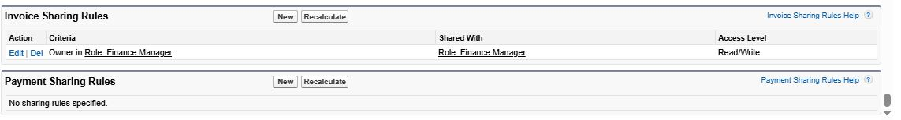  

---

✅ **End of Phase 5 Documentation**  
