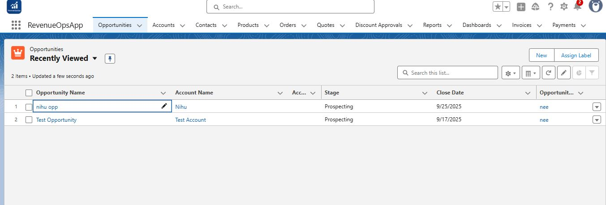
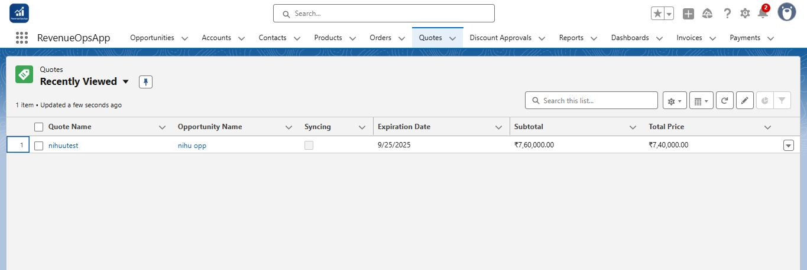
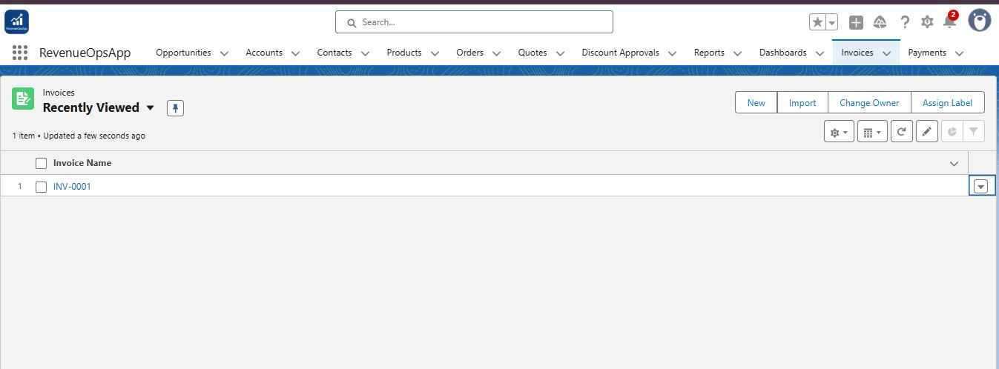
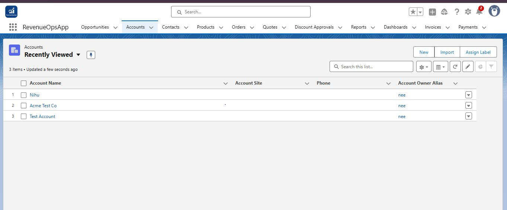
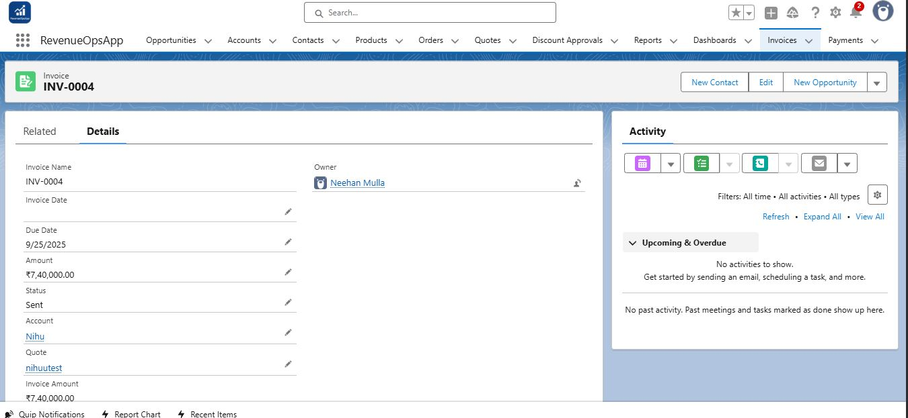
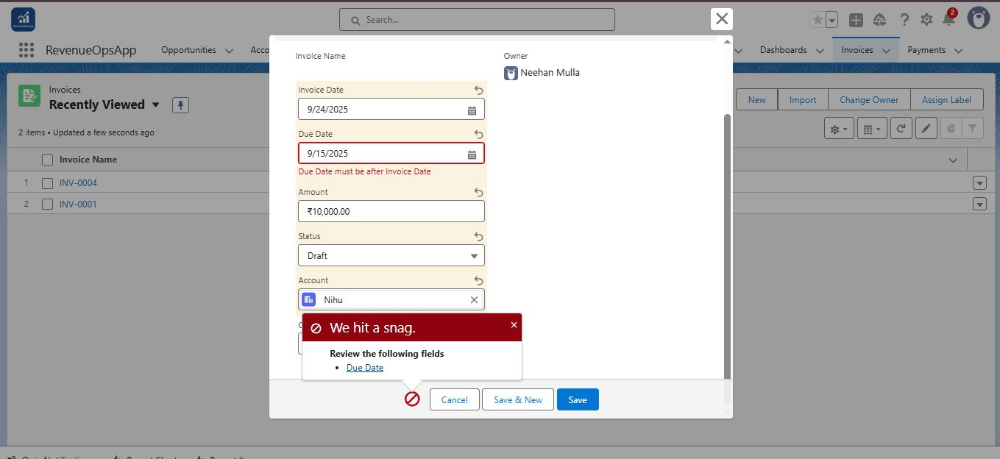
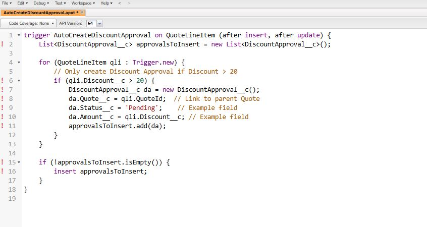
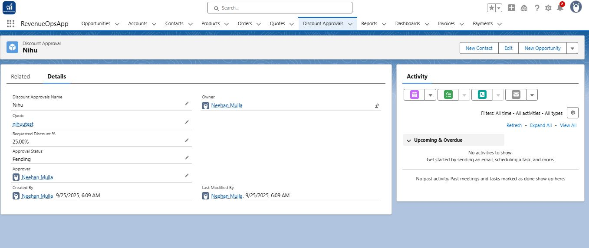

# Phase 6 — Invoice Automation & Apex Enhancements

This phase automates Invoice creation and field population from Quotes, and extends functionality with **Apex automation** for Discount Approvals when the discount is greater than 20%.

---

## Step 1 — Unit Test Setup

- Created base records for testing: **Opportunities, Quotes, and Invoices**.  
- Verified **Quote–Invoice relationship** works correctly.  

**📸 Screenshots:**  
-   
-   
-   
-   

---

## Step 2 — Invoice Auto-Population Flow

- Built a **Record-Triggered Flow** on Invoice.  
- **Logic:**  
  1. **Get Related Quote** – Fetch Quote using `Quote__c`.  
  2. **Update Invoice Fields** – Auto-populate values:  
     - `Amount__c = Quote.TotalPrice`  
     - `Due_Date__c = Quote.ExpirationDate`  
     - `Status__c = "Sent"`  

**📸 Screenshot:**  
-   

---

## Step 3 — Validation Rule

- Implemented rule to ensure **Due Date > Invoice Date**.  
- Prevents saving invalid Invoice records.  

**📸 Screenshot:**  
-   

---

## Step 4 — Apex Automation Enhancements

- Added **Apex Trigger/Class** for extended automation:  
  - Auto-create **Discount Approval** when `Quote.Discount > 20%`.  
  - Auto-update Invoice fields for reliability.  

**📸 Screenshots:**  
-   
-   

---

## 📊 Final Outcome

- Invoice process fully automated.  
- Quotes with Discounts > 20% auto-trigger approval via Apex.  
- Validation rules ensure clean data.  
- Successfully tested with **Opportunities → Quotes → Invoices → Approvals**.
