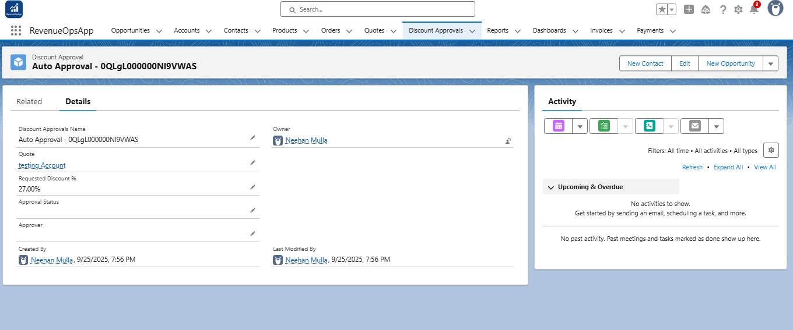
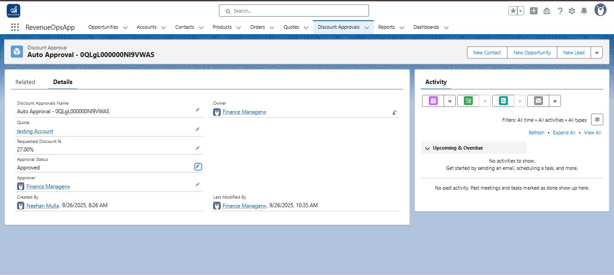
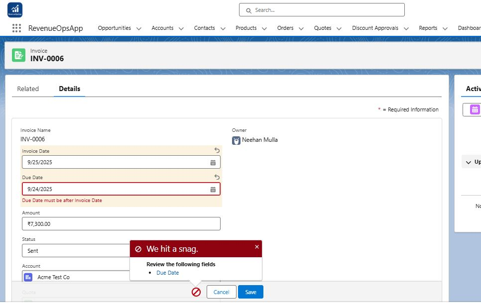
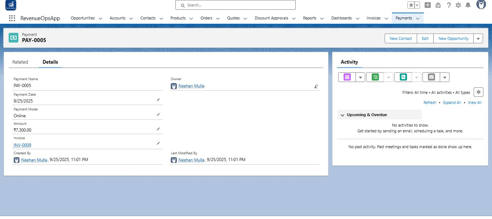

# Phase 7: Testing & Validation  

This phase validates all automation, triggers, and business rules to ensure end-to-end functionality in the **RevenueOpsApp**.  

---

## Step 1 — Test Discount Approval Trigger  

- **Action:** Created a Quote with a Line Item having Discount > 20%.  
- **Expected Result:** Discount Approval record is automatically created and assigned to the Finance Manager.  
- **Screenshot:**  
    

---

## Step 2 — Approval Process Test  

- **Action:** Logged in as Finance Manager → Opened the Discount Approval record → Approved the request.  
- **Expected Result:** Approval Status updates to **Approved**.  
- **Screenshot:**  
    

---

## Step 3 — Validation Rule Test  

- **Action:** Tried creating an Invoice with **Due Date ≤ Invoice Date**.  
- **Expected Result:** Error message appears → *“Due Date must be after Invoice Date”*.  
- **Screenshot:**  
    

---

## Step 4 — Invoice + Payment Link Test  

- **Action:** Created an Invoice linked to a Quote.  
- **Expected Result:** Payment record automatically created with:  
  - Amount = Invoice Amount  
  - Payment Date = Invoice Date  
  - Payment Mode = Online  
  - Linked to the Invoice  
- **Screenshot:**  
    

---

✅ **End of Phase 7 Documentation**  
