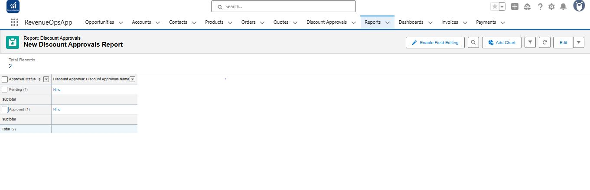
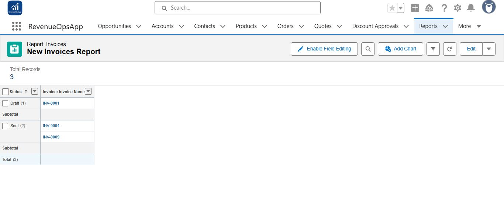
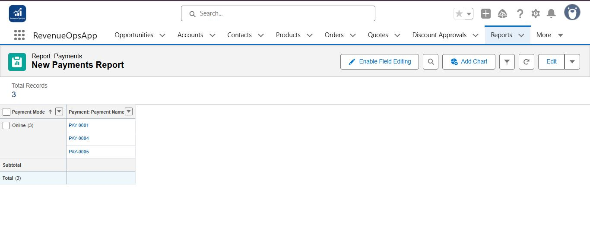
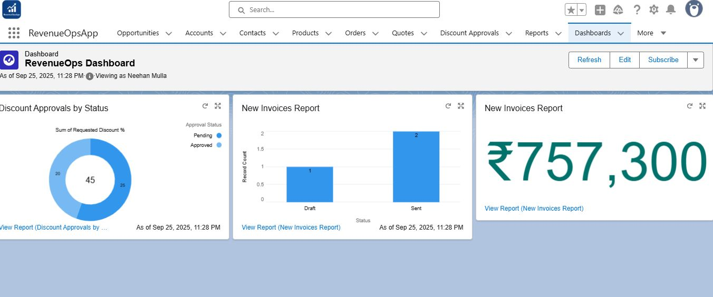

# Phase 8: Reporting & Dashboard (Final Setup)  

This phase provides management visibility into revenue, approvals, and payments through reports and dashboards in **RevenueOpsApp**.  

---

## Step 1 — Reports  

### Discount Approvals Report  
- **Action:** Group Discount Approvals by **Status**.  
- **Details:** Show totals for each status (Pending, Approved, Rejected).  
- **Screenshot:**  
    

### Invoices Report  
- **Action:** Group Invoices by **Status** (Draft, Sent, Paid).  
- **Details:** Summarize **Invoice Amount** for total revenue.  
- **Screenshot:**  
    

### Payments Report  
- **Action:** Group Payments by **Payment Mode** (Cash, Card, Online).  
- **Details:** Show amounts per mode.  
- **Screenshot:**  
    

---

## Step 2 — Dashboard  

- **Add Components:**  
  - **Pie Chart → Discount Approvals by Status**  
    - Source: Discount Approvals Report  
    - Value: Record Count  

  - **Bar Chart → Invoices by Status**  
    - Source: Invoices Report  
    - Value: Record Count  

  - **KPI / Metric → Total Revenue**  
    - Source: Invoices Report  
    - Value: Sum of Invoice Amount  

- **Customize Titles & Layout:**  
  - Pie Chart: Discount Approvals by Status  
  - Bar Chart: Invoices by Status  
  - KPI: Total Revenue  

- **Save Dashboard:**  
  - Name: **RevenueOps Dashboard**  
- **Screenshot:**  
    

---

✅ **End of Phase 8 Documentation**  
