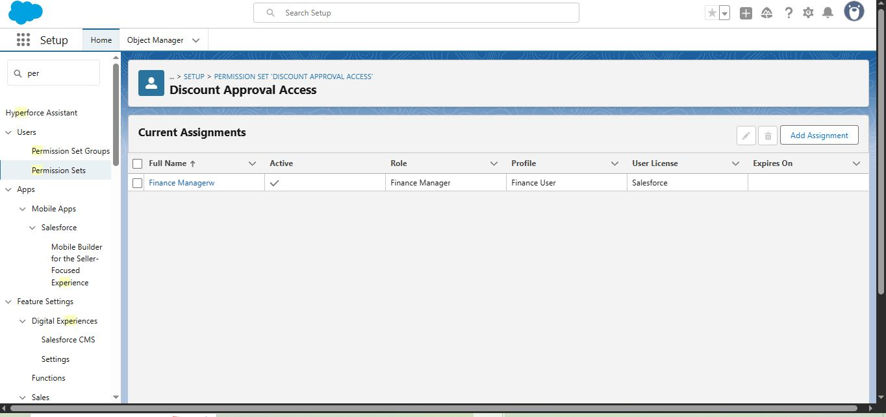
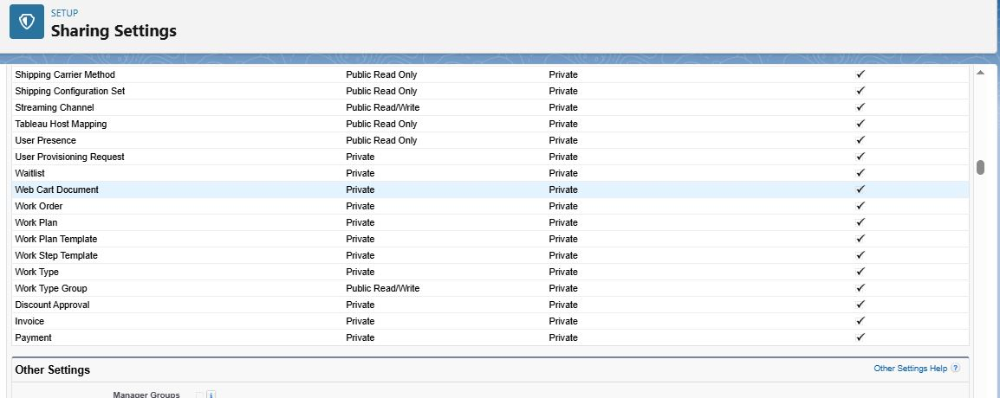
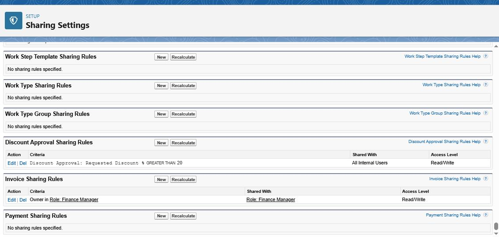

# Phase 9: Security & Access Review (Final)  

This phase ensures proper access control for Finance users and managers in **RevenueOpsApp**.  

---

## Step 1 — Profile Check  

- **Navigate:** Setup → Profiles → Finance User  
- **Verify:** Full access to **Quotes**, restricted access elsewhere.  
- **Screenshot:**  
    

---

## Step 2 — Permission Set Check  

- **Navigate:** Setup → Permission Sets → Discount Approval Access  
- **Verify:** Assigned to **Finance Manager** user.  
- **Details:** Shows current assignments for the Permission Set.  
- **Screenshot:**  
    

---

## Step 3 — OWD & Sharing Rules  

- **Navigate:** Setup → Sharing Settings  
- **Verify Org-Wide Defaults:**  
  - Invoice = Private  
  - Payment = Private  
  - Discount Approval = Private  

- **Sharing Rules:** Verify **Finance Manager** has **Read/Write access**.  
- **Screenshots:**  
    
    

---

✅ **End of Phase 9 Documentation**  
